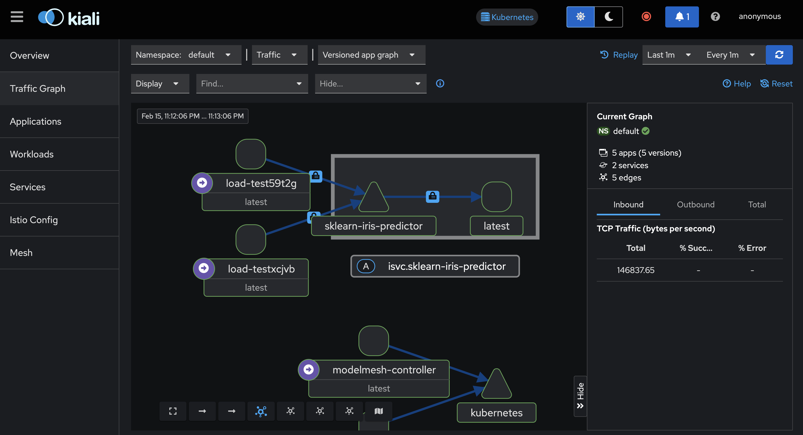

# Deploying Model as InferenceService with KServe

## Initialize Kubernetes Cluster with Minikube
```
minikube start

kubectl get po --all-namespaces # first interaction
```

## Install Istio in Ambient Mode and Gateway API CRDs
https://istio.io/latest/docs/ambient/
```
istioctl install --set profile=ambient --skip-confirmation

kubectl get crd gateways.gateway.networking.k8s.io &> /dev/null || \
  { kubectl apply -f https://github.com/kubernetes-sigs/gateway-api/releases/download/v1.2.0/standard-install.yaml; }

```

## KServe Installation

### Install Cert Manager
https://cert-manager.io/docs/installation/
```
kubectl apply -f https://github.com/cert-manager/cert-manager/releases/download/v1.17.0/cert-manager.yaml
```

### Install KServe and CRD
```
helm install kserve-crd oci://ghcr.io/kserve/charts/kserve-crd --version v0.14.1

helm install kserve oci://ghcr.io/kserve/charts/kserve --version v0.14.1 \
 --set kserve.controller.deploymentMode=RawDeployment

```

## Initiate First InferenceService
```
kubectl apply -f - <<EOF
apiVersion: "serving.kserve.io/v1beta1"
kind: "InferenceService"
metadata:
  name: "sklearn-iris"
spec:
  predictor:
    model:
      modelFormat:
        name: sklearn
      storageUri: "gs://kfserving-examples/models/sklearn/1.0/model"
EOF
```

## Create Istio Gateway
Gateway and HTTPRoute is not required if using Istio ingress
```
kubectl apply -f - <<EOF
apiVersion: gateway.networking.k8s.io/v1
kind: Gateway
metadata:
  name: kserve-gateway
spec:
  gatewayClassName: istio
  listeners:
  - name: http
    port: 80
    protocol: HTTP
    allowedRoutes:
      namespaces:
        from: Same
EOF
```
## Create Istio HTTP Route
```
kubectl apply -f - <<EOF
apiVersion: gateway.networking.k8s.io/v1
kind: HTTPRoute
metadata:
  name: sklearn-iris-predictor
spec:
  parentRefs:
  - name: kserve-gateway
  hostnames:
  - "sklearn-iris-default.example.com"
  rules:
  - backendRefs:
    - name: sklearn-iris-predictor
      port: 80
EOF
```
## Secure Mesh
All pods in the namespace inside ambient mesh through label:
```
kubectl label namespace default istio.io/dataplane-mode=ambient
```

## Minikube Tunnel and Call the Service
```
minikube tunnel
```

```
curl -v -H "Host: sklearn-iris-default.example.com" http://127.0.0.1/v1/models/sklearn-iris:predict -d @./iris-input.json -H "Content-Type: application/json"
```

## LoadTest and Visualization
### Install Prometheus and Kiali
```
kubectl apply -f https://raw.githubusercontent.com/istio/istio/release-1.24/samples/addons/prometheus.yaml
kubectl apply -f https://raw.githubusercontent.com/istio/istio/release-1.24/samples/addons/kiali.yaml
```
### Create Load Testing Job
```
kubectl create -f loadTest.yml
```

### Visualize Through Kiali
```
istioctl dashboard kiali
```

